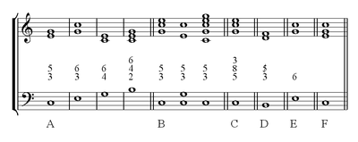

##B. Théorie Musicale
###1. Comment classifier les intervalles et les accords

&nbsp;&nbsp;&nbsp;&nbsp;
Comme nous l&rsquo;avons vu dans le sondage pr&eacute;c&eacute;dent, une grande majorité de personnes sont intuitivement d'accord avec les musiciens quant à la perception de la consonance des accords. Mais avant de les classifier, il faut savoir ce qu&rsquo;est un accord. En musique, un accord est un ensemble identifiable de plusieurs notes simultan&eacute;es, alors qu&rsquo;en harmonie tonale, il d&eacute;signe une combinaison d&rsquo;au moins trois notes jouées simultanément formant un tout. Deux notes jou&eacute;es en m&ecirc;me temps sont consid&eacute;r&eacute;es comme un intervalle harmonique par opposition &agrave; un intervalle m&eacute;lodieux o&ugrave; deux notes sont jou&eacute;es successivement. Si l&rsquo;on joue trois notes simultan&eacute;ment nous obtenons donc deux intervalles harmoniques, le premier form&eacute; par la premi&egrave;re et la deuxi&egrave;me note, et le deuxi&egrave;me intervalle form&eacute; par la premi&egrave;re et la troisi&egrave;me note. Un accord est donc une superposition de plusieurs intervalles, et d&eacute;pend  de ces derniers.

&nbsp;&nbsp;&nbsp;&nbsp;
Tout d&rsquo;abord, il faut savoir comment nous nommons les intervalles. Un intervalle est constitu&eacute; de demi-tons, des unit&eacute;s indivisibles. ll existe plusieurs types de demi-tons: les demi-tons chromatiques, demi-ton entre deux notes de m&ecirc;me nom (e.g. fa et fa#) et les demi-tons diatoniques, demi-ton entre deux notes de nom diff&eacute;rent (e.g. fa# et sol). Le nom de l&rsquo;intervalle est d&eacute;termin&eacute; &agrave; partir du nombre de demi-tons diatoniques qui le composent. Par exemple, un intervalle d&rsquo;un demi-ton diatonique est appel&eacute; seconde.

&nbsp;&nbsp;&nbsp;&nbsp;
Il reste &agrave; d&eacute;finir la qualit&eacute; d&rsquo;un intervalle. Effectivement, les secondes, tierces, sixtes et septi&egrave;mes peuvent &ecirc;tre diminu&eacute;es, mineures, majeures ou augment&eacute;es tandis que les quartes, quintes et octaves peuvent &ecirc;tre diminu&eacute;es, justes ou augment&eacute;es. Ce sont les demi-tons chromatiques qui permettent de changer la qualit&eacute; d&rsquo;un intervalle. Ainsi:

<ul>
<li style="font-weight: 400;">si l'on retranche un demi-ton chromatique &agrave; un intervalle juste il devient diminu&eacute;.</li>
<li style="font-weight: 400;">si l'on retranche un demi-ton chromatique &agrave; un intervalle majeur il devient mineur.</li>
<li style="font-weight: 400;">si l'on retranche un demi-ton chromatique &agrave; un intervalle mineur il devient diminu&eacute;.</li>
<li style="font-weight: 400;">si l'on ajoute un demi-ton chromatique &agrave; un intervalle juste il devient augment&eacute;.</li>
<li style="font-weight: 400;">si l'on ajoute un demi-ton chromatique &agrave; un intervalle mineur il devient majeur.</li>
<li style="font-weight: 400;">si l'on ajoute un demi-ton chromatique &agrave; un intervalle majeur il devient augment&eacute;.</li>
</ul>

<strong>&nbsp;</strong>

<table style="height: 140px;" width="503">
<tbody>
<tr>
<td>

<strong>Intervalles</strong>

</td>
<td colspan="2">

Seconde

</td>
<td colspan="2">

Tierce

</td>
<td>

Quarte

</td>
<td>

Triton

</td>
</tr>
<tr>
<td>

<strong>Demi-tons diatoniques</strong>

</td>
<td colspan="2">

1

</td>
<td colspan="2">

2

</td>
<td>

3

</td>
<td>

3

</td>
</tr>
<tr>
<td>

<strong>Qualit&eacute;</strong>

</td>
<td>

Mineure

</td>
<td>

Majeure

</td>
<td>

Mineure

</td>
<td>

Majeure

</td>
<td>

Juste

</td>
<td>&nbsp;</td>
</tr>
<tr>
<td>

<strong>Demi-tons chromatiques</trong>

</td>
<td>

0

</td>
<td>

1

</td>
<td>

1

</td>
<td>

2

</td>
<td>

2

</td>
<td>

3

</td>
</tr>
</tbody>
</table>

<strong>&nbsp;</strong>

<table style="height: 138px;" width="479">
<tbody>
<tr>
<td style="text-align: center;">

<strong>Intervalles</strong>

</td>
<td style="text-align: center;">

Quinte

</td>
<td style="text-align: center;" colspan="2">

Sixte

</td>
<td style="text-align: center;" colspan="2">

Septi&egrave;me

</td>
<td style="text-align: center;">

Octave

</td>
</tr>
<tr>
<td style="text-align: center;">

<strong>Demi-tons diatoniques</strong>

</td>
<td style="text-align: center;">

4

</td>
<td style="text-align: center;" colspan="2">

5

</td>
<td style="text-align: center;" colspan="2">

6

</td>
<td style="text-align: center;">

7

</td>
</tr>
<tr>
<td style="text-align: center;">

<strong>Qualit&eacute;

</td>
<td style="text-align: center;">

Juste

</td>
<td style="text-align: center;">

Mineure

</td>
<td style="text-align: center;">

Majeure

</td>
<td style="text-align: center;">

Mineure

</td>
<td style="text-align: center;">

Majeure

</td>
<td style="text-align: center;">

Juste

</td>
</tr>
<tr>
<td style="text-align: center;">

<strong>Demi-tons chromatiques</strong>

</td>
<td style="text-align: center;">

3

</td>
<td style="text-align: center;">

3

</td>
<td style="text-align: center;">

4

</td>
<td style="text-align: center;">

4

</td>
<td style="text-align: center;">

5

</td>
<td style="text-align: center;">

5

</td>
</tr>
</tbody>
</table>

<em>Tableau 2: quelques intervalles classiques et leurs demi-tons correspondants</em>

&nbsp;&nbsp;&nbsp;&nbsp;
    En musique, deux sons qui ont une octave de diff&eacute;rence sont la m&ecirc;me note: c&rsquo;est le principe de l&rsquo;identit&eacute; des octaves. Il en est de m&ecirc;me pour les intervalles. Ainsi, un intervalle d&eacute;doubl&eacute;, c&rsquo;est-&agrave;-dire un intervalle auquel nous avons ajout&eacute; au moins une octave, sonne pareil que l&rsquo;intervalle simple. Par exemple, la tierce majeure form&eacute;e entre do et mi sonne comme la 10e majeure entre do et mi une octave au dessus. (Ceci est vrai en harmonie classique mais l&rsquo;est moins dans d&rsquo;autres courants musicaux comme le jazz o&ugrave; les intervalles conservent leur identit&eacute; jusqu&rsquo;&agrave; la 13e).

&nbsp;&nbsp;&nbsp;&nbsp;
    Comme nous l&rsquo;avons vu pr&eacute;c&eacute;demment, un accord est la superposition d&rsquo;au moins trois notes. Il est dit arp&eacute;g&eacute; si elles sont jou&eacute;es successivement, et plaqu&eacute; si elles sont jou&eacute;es simultan&eacute;ment. Un accord est donc la superposition de plusieurs intervalles. Pour les noter, on reporte l&rsquo;intervalle form&eacute; entre chaque note de l&rsquo;accord et la note la plus grave: la basse. Par exemple, pour un accord form&eacute; des notes do, mi et sol, la basse est do, donc nous reportons l&rsquo;intervalle entre do et mi, une tierce majeure (not&eacute;e 3) et do et sol, une quinte juste (not&eacute;e 5). Nous empilons ces nombres les uns sur les autres, ce qui nous donne le chiffrage de l&rsquo;accord. Ainsi, si un musicien conna&icirc;t la basse et le chiffrage d&rsquo;un accord, il pourra le d&eacute;duire sans ambigu&iuml;t&eacute;.

<em>Exemple de chiffrage d'accords</em>

&nbsp;&nbsp;&nbsp;&nbsp;
	Un accord est dit classé lorsqu’il est réductible à une superposition de tierces. Les accords classés de trois notes, aussi appelés triades, comprennent la note fondamentale, sa tierce et sa quinte. Les accords à quatre notes comprennent une triade à laquelle nous ajoutons l’intervalle de septième (majeure ou mineure) ou la sixte majeure. Les accords de cinq notes ou plus comprennent en plus de l’accord de quatre notes, la seconde, la quarte ou la sixte.

&nbsp;&nbsp;&nbsp;&nbsp;
	Mais un accord n’est pas déterminé que par son chiffrage. En effet, les musiciens ont remarqué que si l’on permute l’ordre des notes la “structure” de l’accord reste la même, c’est ce que l’on appelle en musique un renversement. Par exemple, l’accord mi, sol, do est un renversement de l’accord do, mi, sol. Ainsi, l’accord n’est pas en réalité une simple succession de notes mais plutôt leur structure invariante par permutation de l’ordre des notes qui les constituent ou par renversements. Par exemple les deux renversements cités plus haut représentent en réalité le même accord: l’accord parfait majeur.

&nbsp;&nbsp;&nbsp;&nbsp;
	C’est ainsi que l’on classifie un accord et cette classification met en évidence des différences entre les accords, différences qui peuvent liées à la consonance et dissonance.

