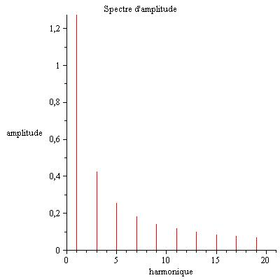
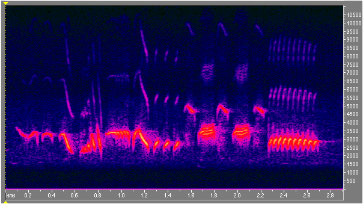
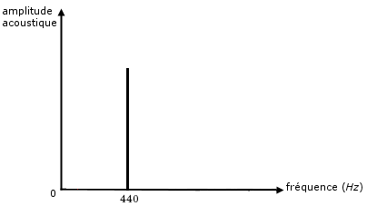
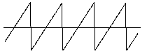

###2. L'analyse de Fourier et le timbre

&nbsp;&nbsp;&nbsp;&nbsp;
	Nous nous intéressons particulièrement aux solutions de l’équation d’onde qui sont périodiques dans le temps. Pour les étudier, nous utiliserons un outil mathématique très utile, l’analyse de Fourier. Elle nous permet de décomposer une fonction périodique en une série (ou somme infinie) de fonctions sinusoïdales dont les fréquences sont multiples (entiers) à la fréquence fondamentale (l’inverse de la période de notre fonction de départ). C’est à dire, si l’on fixe un point dans l’espace et que l’on s’occupe uniquement de la valeur de l’onde à cet endroit, elle ne dépendra que du temps. Si l’on suppose qu’elle est périodique dans le temps, nous pouvons noter $$f(t)$$ notre onde de période T, et d’après l’analyse de Fourier, nous pouvons l’écrire sous la forme:

$$
f(t)=\sum_{k=0} ^ {\infty} a_k \cos{(2 \pi f_0 k t)}+b_k \sin(2 \pi f_0 k t)
$$

où $$f0$$ est la fréquence fondamentale (donc $$\frac{1}{T}$$) et les coefficients constants $$ak$$ et $$bk$$ peuvent être calculés en fonction de $$f$$ par les formules

	$$
	ak=\frac{2}{T} \int_{\frac{-T}{2}}^{\frac{T}{2}} f(x) \cos(k x)dx
	$$

	et

$$
	bk=\frac{2}{T} \int_{\frac{-T}{2}}^{\frac{T}{2}} f(x) \sin(k x)dx
	$$

où $$T$$ est la période de $$f$$. On note quand même que l’on a implicitement supposé que notre série est convergente. Pour visualiser cette décomposition en harmoniques, nous utilisons souvent un spectrogramme, un graphique représentant en abscisse les fréquences des harmoniques et en ordonnée leurs amplitudes respectives.

&nbsp;&nbsp;&nbsp;&nbsp;&nbsp;&nbsp;&nbsp;&nbsp;&nbsp;&nbsp;&nbsp;&nbsp;&nbsp;&nbsp;&nbsp;&nbsp;&nbsp;&nbsp;&nbsp;&nbsp;&nbsp;&nbsp;&nbsp;&nbsp;&nbsp;&nbsp;&nbsp;&nbsp;&nbsp;&nbsp;&nbsp;&nbsp;&nbsp;&nbsp;&nbsp;&nbsp;&nbsp;&nbsp;&nbsp;&nbsp;&nbsp;&nbsp;&nbsp;&nbsp;&nbsp;

&nbsp;&nbsp;&nbsp;&nbsp;
    Lorsque le spectrogramme change en fonction du temps, nous utilisons aussi un sonagramme, où l’on représente le temps en abscisse et les fréquences des harmoniques en ordonnées, et leurs amplitudes relatives sont soit représentées par des codes couleurs, soit en introduisant un nouvel axe pour les amplitude (auquel cas le graphe sera en 3D).

&nbsp;&nbsp;&nbsp;&nbsp;
    On peut généraliser la série de Fourier et l’étendre à une fonction quelconque (comme si elle avait une période infinie), mais ce ne sera alors plus une série discrète d’harmoniques mais une intégrale continue d’harmoniques et pour calculer les amplitudes respectives de chaque partiels il faut désormais utiliser la transformée de Fourier. nous donnerons maintenant une interprétation acoustique de la série de Fourier.

&nbsp;&nbsp;&nbsp;&nbsp;
    Bien que plusieurs sons aient la même hauteur, nous arrivons à les différencier. Par exemple, la note d’une guitare et d’un piano sont distinguables, mettant en évidence une nouvelle caractéristique du son: le timbre. Cette caractéristique permet d’établir la pureté d’un son. Par exemple, le premier enregistrement est plus pur que le deuxième même s’ils ont la même hauteur.

../img/icon.jpg,../audio/enregistrement 3.1.wav"

../img/icon.jpg,../audio/enregistrement 3.2.wav

&nbsp;&nbsp;&nbsp;&nbsp;
    En réalité, c’est parce que si l’on décompose ces deux ondes avec la série de Fourier, nous remarquerons que la première onde ne contient qu’un seul harmonique, alors que la deuxième en contient une infinité.

&nbsp;&nbsp;&nbsp;&nbsp;&nbsp;&nbsp;&nbsp;&nbsp;&nbsp;&nbsp;&nbsp;&nbsp;

&nbsp;&nbsp;&nbsp;&nbsp;&nbsp;&nbsp;&nbsp;&nbsp;&nbsp;&nbsp;&nbsp;&nbsp;&nbsp;&nbsp;&nbsp;&nbsp;&nbsp;&nbsp;&nbsp;&nbsp;&nbsp;&nbsp;&nbsp;&nbsp;&nbsp;&nbsp;&nbsp;&nbsp;&nbsp;&nbsp;&nbsp;&nbsp;

&nbsp;&nbsp;&nbsp;&nbsp;
    Le son le plus pur correspond donc à une onde sinusoïdale. Une interprétation musicale de l’analyse de Fourier est que toute onde périodique peut être décomposée en une superposition de sons purs dont les fréquences sont multiples de la fréquence fondamentale. La complexité d’un son résulte du nombre de sons pur qui le composent (dont les intensités sont non négligeables) jusqu’à produire le son blanc lorsque toutes les harmoniques ont plus ou moins la même intensité

&nbsp;&nbsp;&nbsp;&nbsp;
    Ici nous abordons donc la pureté d’un son. Ainsi plus le son est pur, plus il est agréable à écouter comme nous l’avons remarqué avec les enregistrement. Nous faisons les premiers pas dans une explication physique et mathématiques de la consonance, et nous introduisons un outil important pour comprendre l’analyse de Fourier.

