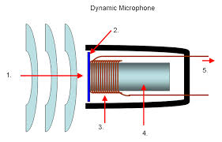
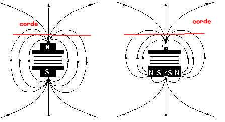

### Les outils d'enregistrement

&nbsp;&nbsp;
    Toute expérience nécessite des outils pour la réaliser, et il est toujours important de bien comprendre comment fonctionne ces outils avant de les utiliser. Pour cela, nous avons recherché quelques informations sur le fonctionnement d’un microphone avant de réaliser nos expériences.

Tout microphone possède un diaphragme, aussi appelé membrane, qui est poussé par les vibrations perçues, comme le son. La variation de la pression acoustique du milieu fait bouger le diaphragme. Pour pouvoir détecter et enregistrer les mouvements du diaphragme, nous les convertissons au préalable en courant électrique oscillant. C’est la méthode de conversion qui caractérise le type de microphone.

Le microphone dynamique, aussi appelé microphone à bobine mobile, est le plus fréquemment utilisé. Il utilise une bobine qui est attachée à la membrane pour créer ce courant; il vibre donc avec la membrane. Cette bobine est située dans le champ magnétique fixe d’un aimant: leur mouvement relatif génère donc un courant alternatif par induction. Ce type de microphone est très souvent utilisé car aucun courant est requis pour le faire fonctionner.

1. Pression acoustique&nbsp;&nbsp;&nbsp;&nbsp;&nbsp;&nbsp;&nbsp;&nbsp;&nbsp;&nbsp;
2. Diaphragme&nbsp;&nbsp;&nbsp;&nbsp;&nbsp;&nbsp;&nbsp;&nbsp;&nbsp;&nbsp;
3. Bobine &nbsp;&nbsp;&nbsp;&nbsp;&nbsp;&nbsp;&nbsp;&nbsp;&nbsp;&nbsp;

4. Aimant &nbsp;&nbsp;&nbsp;&nbsp;&nbsp;&nbsp;&nbsp;&nbsp;&nbsp;&nbsp;
5. Courant électrique

&nbsp;&nbsp;
Le terme “micro” est utilisé dans le cadre d’un instrument électrique, notamment la guitare électrique, la basse électrique et le piano électrique. Ceux-ci ne sont pas des microphones, mais des capteurs électromagnétiques. Ces capteurs fonctionnent de manière similaire aux microphones dynamiques, avec un aimant et un métal, l’aimant se rapprochant et s’éloignant du métal. Les cordes (ou plaques métalliques dans le cas du piano électrique), magnétiques, jouent le rôle de la bobine, et vibrent lorsqu’elles génèrent un son. Ce mouvement des cordes relatif à l’aimant crée des variations dans le champs magnétique, qui est ensuite enregistré par une bobine entourant l’aimant. Ces systèmes sont utilisés dans les instruments électriques car ils contournent des problèmes liés à l’effet Larsen (l’effet Larsen est un effet d’amplification d’un son à une certaine fréquence, créé lorsqu’un microphone capture le son émis par l'amplificateur qui lui est lié, créant une boucle, le son s’amplifiant à chaque fois). Pour contourner des interférences potentielles dans le champs magnétique de l’aimant, un système avec deux capteurs électromagnétiques est souvent employé, dont les sens de polarité des aimants sont inversés. Dans ce cas, les interférences s’annulent, mais les variations liés au déplacement de la corde ou de la plaque métallique s’ajoutent.

<em> Image d’une barre de six capteurs électromagnétiques de guitare électrique </em>

<em> Schéma modélisant les deux types de capteurs électromagnétiques d’une guitare électrique </em>

&nbsp;&nbsp;
L’oreille est un organe de l’homme qui permet d’enregistrer des ondes acoustiques et de les transmettre au cerveau à l’aide de messages nerveux. Il réussit à identifier des sons différents qui semblent pourtant être superposés. Dans la cochlée, l’oreille analyse des différentes vibrations générées par le son, et trouve des fréquences (grâce aux vibrations dans le liquide de la cochlée) qui sont des multiples entre elles: nous appellons cela les harmoniques d’une note fondamentale. L’oreille assemble ces harmoniques, et en dégage un seul son.

