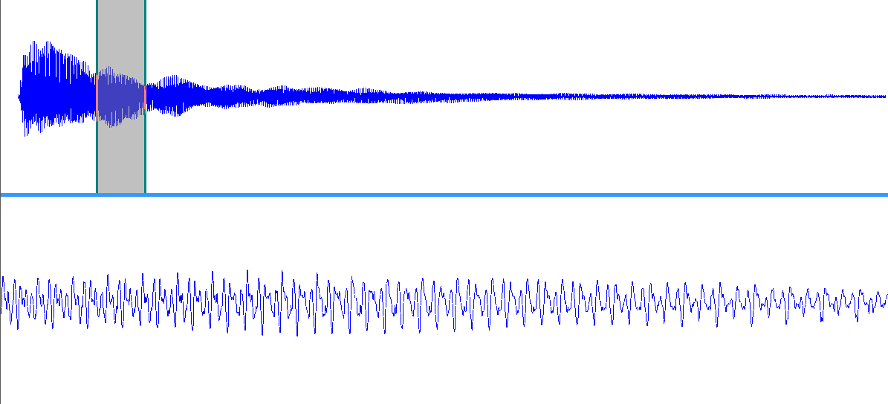
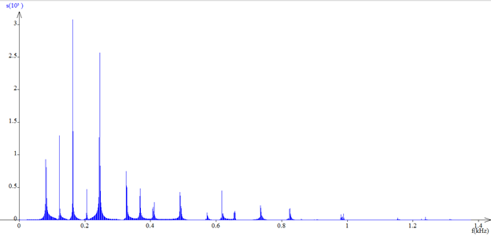

### Étude de cas sur l'accord parfait majeur

&nbsp;&nbsp;
	Notre oreille réussit à décomposer des bruits très complexes, qui sont des mélanges de nombreux sons. Nous pouvons réaliser une analyse similaire grâce à un logiciel. Afin de comprendre les différences de consonance entre deux accords, nous avons décidé d’étudier des vrai sons, et non des sons générés par un logiciel informatique. Pour ce faire, nous avons enregistré des notes et des accords de guitare électrique pour pouvoir les analyser et les comparer.

&nbsp;&nbsp;
	Voici l'expérience que nous avons réalisé pour tenter d’étudier des vrai sons:

	<strong>
		Matériel:
	</strong>

<ul>
	<li >
		Guitare électrique
	</li>
	<li >
		Microphone dynamique avec port USB
	</li>
	<li >
		Ordinateur avec le programme Regavi et Regressi
	</li>
</ul>

	<strong>
		Protocole:
	</strong>

	Nous allons connecter le microphone à l’ordinateur puis jouer une série de notes, par exemple un do à corde relâchée, un mi, un sol, etc. Une fois les enregistrements réalisés nous jouerons des accords, tels que l’accord de do majeur, ou l’accord de septième diminuée. Après avoir tout enregistré, nous allons vérifier l’exactitude des enregistrements en les comparant à des sons générés par ordinateur censés correspondre aux notes et accords enregistrés. à l’aide du programme Regavi et du programme Regressi.

	<strong>
		Après l’expérience:
	</strong>

	Nous avons rencontré des difficultés pour reproduire les sons sur l’ordinateur, et après consultation auprès du professeur, nous en avons conclu qu’il s’agissait d’un dysfonctionnement du programme utilisé. Nous allons donc utiliser une autre version du programme selon les conseils du professeur de physique.

	Nous somme confrontés à un autre problème. Après réflexion, nous avons constaté l’invalidité de nos enregistrements, dû à deux facteurs:

<ul>
	<li >
		L’environnement dans lequel ils ont été réalisés étaient trop bruyant
	</li>
	<li >
		Nous avons collé le microphone à la caisse de résonance, nous avons donc enregistré non pas les sons générés par la corde, mais les vibrations de la plaque en plastique couvrant la caisse de résonance.
	</li>
</ul>

	Cette expérience demande donc à être réitérée ultérieurement. Voici donc notre deuxième expérience que nous avons réalisé. Elle consiste en enregistrant un accord de Mi majeur, puis l’analysant en utilisant un logiciel.

	<strong>
		Matériel:
	</strong>

<ul>
	<li >
		Guitare électrique
	</li>
	<li >
		Câble ‘jack’
	</li>
	<li >
		Carte son externe U-Phoria UMC 22
	</li>
	<li >
		Ordinateur avec le programme Audacity, Regavi et Regressi
	</li>
</ul>

	<strong>
		Protocole:
	</strong>

	Nous allons enregistrer un accord parfait majeur de Mi (Mi2, Sol#2, Si2) joué et enregistré dans un lieu silencieux avec le programme Audacity. La guitare électrique est branchée à l’ordinateur (par le biais de la carte son), utilisant donc les capteurs électromagnétiques intégrés dans la guitare pour enregistrer le son. Les enregistrements seront ensuite transférés au programme Regavi, qui les traitera pour ensuite les envoyer vers le programme Regressi. Ce programme décomposera le signal périodique obtenu grace à l’enregistrement, nous donnant le spectrogramme de l’accord. A l’aide des outils offerts par le programme, nous analyserons le spectrogramme obtenu.

../img/icon.jpg,../audio/accord parfait majeur de Mi.wav"

		<em>
			Choix de la période avec le programme Regavi
		</em>

<em>Spectrogramme  de la fréquence en kHz par rapport à l’amplitude obtenu avec Regressi</em>

<table>
	<tbody>
		<tr>
			<td>
				

					<strong>
						Fréquences (Hz)
					</strong>
				

			</td>
			<td>
				

					-
				

			</td>
			<td>
				

					80
				

			</td>
			<td>
				

					122.5
				

			</td>
			<td>
				

					162
				

			</td>
			<td>
				

					205
				

			</td>
			<td>
				

					244
				

			</td>
			<td>
				

					-
				

			</td>
			<td>
				

					325
				

			</td>
			<td>
				

					368
				

			</td>
			<td>
				

					411
				

			</td>
		</tr>
		<tr>
			<td>
				

					<strong>
						Fréquences attendues
					</strong>
				

			</td>
			<td>
				

					40
				

			</td>
			<td>
				

					80
				

			</td>
			<td>
				

					120
				

			</td>
			<td>
				

					160
				

			</td>
			<td>
				

					200
				

			</td>
			<td>
				

					240
				

			</td>
			<td>
				

					280
				

			</td>
			<td>
				

					320
				

			</td>
			<td>
				

					360
				

			</td>
			<td>
				

					400
				

			</td>
		</tr>
	</tbody>
</table>

 
	<em>
		 Tableau 4: comparaison des fréquences des premières harmoniques de l’enregistrement avec leurs valeurs théoriques
	</em>

&nbsp;&nbsp;
	Nous constatons que ces fréquences correspondent approximativement à une suite arithmétique de raison 40, donc qu’elles correspondent aux harmoniques du spectre d’un son dont la fréquence fondamentale est 40 Hz. La note correspondante à cette fréquence est donc la même que celle de 320 Hz (320=8*40). En étudiant l’intervalle entre cette fréquence et celle du La3 (440Hz) nous obtenons le rapport $$\frac{440}{320}$$ ~ $$\frac{4}{3}$$ donc leur intervalle est une quarte. La note inconnue est donc une quarte en dessous du La3, soit le Mi3, donc la note est un Mi (ceci est justifié puisque si l’on regarde la fréquence du Mi0, nous trouvons une fréquence de 41,2 Hz). Toutes les harmoniques de l’accord correspondent à celle du Mi0, ce qui justifie appellation de cette note comme fondamentale de l’accord.

&nbsp;&nbsp;
	En particulier, les notes de l’accord joué correspondent aux 4e, 5e et 6e harmoniques du spectre du Mi0 (75Hz). Ainsi nous pouvons penser que la raison de la consonance de cet accord est qu’il est constitué des premières harmoniques d’une note, le rendant ainsi plus naturel à notre oreille

