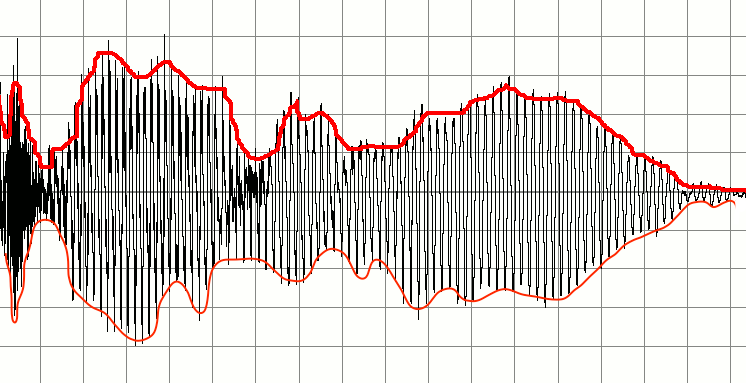
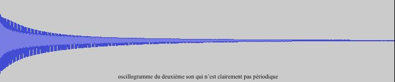
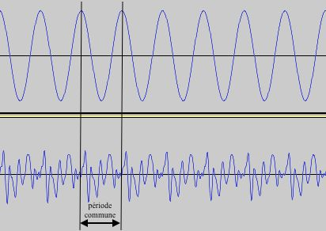
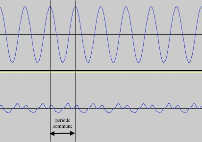

## L’intensité et la hauteur

L&rsquo;intensit&eacute; d&rsquo;un son correspond &agrave; la perception de l&rsquo;amplitude de la fonction d&rsquo;onde, c&rsquo;est &agrave; dire la variation maximale de la pression. Ainsi, elle se mesure en Pascal dans le Syst&egrave;me International d&rsquo;unit&eacute;. L&rsquo;amplitude peut changer au cours du temps, et pour visualiser cela, nous utilisons les enveloppes, c&rsquo;est &agrave; dire que l&rsquo;on prend la courbe qui passe par les maximas locaux (enveloppe sup&eacute;rieure) et celle qui passe par les minimas locaux (enveloppe inf&eacute;rieure). En faisant la diff&eacute;rence des deux &agrave; un instant, nous obtenons l&rsquo;amplitude de l&rsquo;onde &agrave; cet instant.

Lorsque la fonction d&rsquo;onde est p&eacute;riodique dans le temps, notons $$T$$ la p&eacute;riode et $$f$$, sa fr&eacute;quence (l&rsquo;inverse de la p&eacute;riode). Fixons la fonction d&rsquo;onde &agrave; un point de l&rsquo;espace de tel sorte qu&rsquo;elle ne d&eacute;pend plus que du temps, au quel cas nous pouvons la noter $$f(t)$$ avec $$f$$ p&eacute;riodique. Lorsque nous entendons un son, la hauteur per&ccedil;ue correspond &agrave; la fr&eacute;quence. En effet, plus nous augmentons la fr&eacute;quence, plus la hauteur per&ccedil;ue para&icirc;tra aigu&euml;. Par exemple, ces deux enregistrements sont des signaux p&eacute;riodiques de fr&eacute;quences respectives $$440Hz$$ et $$880Hz$$. Si nous les &eacute;coutons, nous percevons bien que le deuxi&egrave;me son est plus aigu que le premier.

../img/icon.jpg,./audio/enregistrement 1.1.wav

../img/icon.jpg,./audio/enregistrement 1.2.wav

De plus, si l&rsquo;on peut d&eacute;composer l&rsquo;onde p&eacute;riodique en une somme d&rsquo;harmoniques avec la s&eacute;rie de Fourier, alors la hauteur per&ccedil;ue correspondra &agrave; celle de la fr&eacute;quence fondamentale.

Mais m&ecirc;me si une onde n&rsquo;est pas p&eacute;riodique nous percevons toujours une hauteur. Par exemple, les deux sons enregistr&eacute;s sont bien de la m&ecirc;me hauteur bien que le deuxi&egrave;me son n&rsquo;est pas p&eacute;riodique.

../img/icon.jpg,./audio/enregistrement 2.1.wav

../img/icon.jpg,./audio/enregistrement 2.2.wav

Mais si l&rsquo;on compare de plus pr&egrave;s les deux oscillogrammes, nous nous rendons compte qu&rsquo;au voisinage d&rsquo;un instant, l&rsquo;oscillogramme du deuxi&egrave;me enregistrement para&icirc;t p&eacute;riodique et partage la m&ecirc;me p&eacute;riode que le premier.

On peut expliquer ce ph&eacute;nom&egrave;ne en supposant que la fonction d&rsquo;onde du deuxi&egrave;me enregistrement est un signal p&eacute;riodique &agrave; amplitude variable, c&rsquo;est &agrave; dire qu&rsquo;il peut &ecirc;tre &eacute;crit par exemple $$f(t)=A(t)*g(t)$$, o&ugrave; g est p&eacute;riodique. Ainsi, bien que son enveloppe ne soit pas p&eacute;riodique, nous pouvons quand m&ecirc;me associer une fr&eacute;quence &agrave; l&rsquo;onde.

Pour les sons, nous partons du principe &agrave; chaque fois que le signal sonore correspondant est p&eacute;riodique, donc nous pouvons associer &agrave; un son des &ldquo;coups,&rdquo; c&rsquo;est &agrave; dire un &eacute;v&egrave;nement p&eacute;riodique dont la p&eacute;riode est celle du signal. Cette consid&eacute;ration en terme de coups a donc un fondement physique.

<table>
<tbody>
<tr>
<td>

- - - - - - - - - - - - - - - - - - - - - - - - - - - - - - - - - - - - - - - - - - -

</td>
</tr>
</tbody>
</table>

<em> Représentation schématique d’un son par des coups </em>
