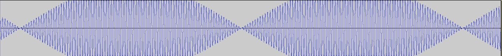

## Superposition de plusieurs notes

&nbsp;&nbsp;
Maintenant que nous avons vu les trois propri&eacute;t&eacute;s fondamentales d&rsquo;une note (la hauteur, le timbre et l&rsquo;intensit&eacute;) ainsi que leurs grandeurs physique associ&eacute;es, nous savons d&eacute;sormais d&eacute;crire enti&egrave;rement un son. Mais il ne faut pas perdre de vue notre probl&eacute;matique qui se repose sur la consonance des accords, donc il faudra maintenant chercher &agrave; d&eacute;crire ce qui se passe lorsque nous superposons plusieurs sons en m&ecirc;me temps.

&nbsp;&nbsp;
Une propri&eacute;t&eacute; remarquable de l&rsquo;&eacute;quation d&rsquo;onde est qu&rsquo;elle est lin&eacute;aire, c&rsquo;est &agrave; dire que si l&rsquo;on a deux solutions, leur somme en est une aussi. Ainsi, pour superposer deux ondes, nous les additionnons simplement et elle ne l'influenceront pas mutuellement, propri&eacute;t&eacute; connue sous le nom du principe de superposition.

&nbsp;&nbsp;
Par exemple, superposons deux ondes sinuso&iuml;dales de m&ecirc;me amplitude et de fr&eacute;quence respectives $$f_1$$ et $$f_2$$ et de m&ecirc;me phase. Par une identit&eacute; trigonom&eacute;trique, nous calculons que l&rsquo;onde r&eacute;sultante vaut donc:

$$
A\sin(2 \pi f_1 t)+ A\sin(2 \pi f_2 t) = 2 A \sin(2 \pi \frac{f_1+f_2}{2}t) cos(2 \pi \frac{f_1-f_2}{2}t)
$$

&nbsp;&nbsp;On remarque que lorsque les deux fr&eacute;quences tendent l&rsquo;une vers l&rsquo;autre, le facteur $$\sin(2 \pi \frac{f_1+f_2}{2}t)$$ tend vers une onde dont la fr&eacute;quence est proche des deux de d&eacute;part (c&rsquo;est leur moyenne). Le facteur $$cos(2 \pi \frac{f_1-f_2}{2}t)$$  tend vers une onde dont la fr&eacute;quence est tr&egrave;s petite lorsque les deux fr&eacute;quences se rapprochent. Ainsi, c&rsquo;est une onde dont l&rsquo;enveloppe a une p&eacute;riode tr&egrave;s longue. Cette grande enveloppe se traduit par une modulation d&rsquo;amplitude du son r&eacute;sultant, ce qui est tr&egrave;s d&eacute;sagr&eacute;able &agrave; l&rsquo;oreille, et l&rsquo;on appelle ce ph&eacute;nom&egrave;ne les battements. Par exemple, cet enregistrement est la superposition de deux sons de fr&eacute;quences voisines ($$440 Hz$$ et $$450 Hz$$), et l&rsquo;on entend tr&egrave;s clairement les battements.

../img/icon.jpg,../audio/enregistrement 4.1.wav

&nbsp;&nbsp;L&rsquo;&eacute;cart entre deux sons peut &ecirc;tre quantifi&eacute; par le rapport des fr&eacute;quences des deux notes consid&eacute;r&eacute;es. nous remarquons que c&rsquo;est une grandeur sans unit&eacute; qui est ind&eacute;pendante de l&rsquo;unit&eacute; de temps que l&rsquo;on choisit au d&eacute;part pour mesurer leurs fr&eacute;quences respectives, donc c&rsquo;est bien une propri&eacute;t&eacute; intrins&egrave;que. &Agrave; chaque intervalle, nous pouvons donc associer un rapport.

&nbsp;&nbsp;<strong><strong>&nbsp;</strong></strong>

TODO TABLEAU

&nbsp;&nbsp;<em>Tableau 5: intervalles classiques avec leurs rapports correspondants</em>

&nbsp;&nbsp;<strong><strong>&nbsp;</strong></strong>

&nbsp;&nbsp;On remarquera la diff&eacute;rence entre une note et un son, puisque la note est attribu&eacute;e &agrave; un son &agrave; une hauteur &agrave; une octave pr&egrave;s. C&rsquo;est &agrave; dire que deux sons espac&eacute;s d&rsquo;un nombre quelconque d&rsquo;octave repr&eacute;sentent la m&ecirc;me note. Autrement dit, le rapport des fr&eacute;quences des deux notes est une puissance de deux. Posons la relation binaire entre deux fr&eacute;quences $$f$$ et $$f'$$, et d&eacute;finissons la de telle sorte que $$f$$ et $$f'$$ v&eacute;rifient la relation si et seulement s&rsquo;il existe un entier n (qui peut &ecirc;tre n&eacute;gatif) tel que $$f=2nf'$$. Nous pouvons v&eacute;rifier sans peine que la relation est r&eacute;flexive, sym&eacute;trique et transitive, donc est une relation d&rsquo;&eacute;quivalence. Nous pouvons ainsi d&eacute;finir math&eacute;matiquement ce qu&rsquo;est une note: c&rsquo;est une classe d&rsquo;&eacute;quivalence par cette relation.

&nbsp;&nbsp;Comme pour les notes, les rapports correspondants aux intervalles d&eacute;doubl&eacute;s peuvent &ecirc;tre munis d&rsquo;une relation d&rsquo;&eacute;quivalence qui permet d&rsquo;identifier les intervalles simples aux intervalles d&eacute;doubl&eacute;s. Ainsi deux rapports $$r$$ et $$r'$$ seront &eacute;quivalents lorsque $$r=2nr'$$ o&ugrave; n est un entier. Ainsi, en multipliant un rapport par une puissance de deux bien choisie, nous pouvons toujours se ramener &agrave; un rapport entre 1 et 2, soit un intervalle entre l&rsquo;unisson et une octave.

&nbsp;&nbsp;Ce concept d&rsquo;utiliser les rapports de fr&eacute;quence au lieu des diff&eacute;rence peut para&icirc;tre contre intuitif puisqu&rsquo;il sous entend donc une perception logarithmique de la hauteur, ce qui veut dire que notre oreille ne per&ccedil;oit uniquement la diff&eacute;rence relative de hauteur de deux sons.

&nbsp;&nbsp;Nous pouvons de m&ecirc;me caract&eacute;riser des accords par des coordonn&eacute;es homog&egrave;nes. Par exemple, pour trois notes de fr&eacute;quences $$f_1$$, $$f_2$$, et $$f_3$$, on notera donc l&rsquo;accord $$f_1:f_2:f_3$$, et donc l&rsquo;accord $$k*f_1:k*f_2:k*f_3$$ sera consid&eacute;r&eacute; comme &eacute;quivalent ($$k$$ est un r&eacute;el positif). Musicalement, cette &eacute;quivalence montre que si l&rsquo;on transpose un accord (terme musical pour translation en terme de hauteur) on obtiendra toujours le m&ecirc;me accord.

&nbsp;&nbsp;Ainsi, nous pouvons quantifier les accords de cette mani&egrave;re et donc &eacute;tudier sa consonance revient &agrave; &eacute;tudier ces coordonn&eacute;es. Nous verrons maintenant comment Euler exploite ceci pour qualifier la consonance d&rsquo;un accord.

&nbsp;&nbsp;&nbsp;
