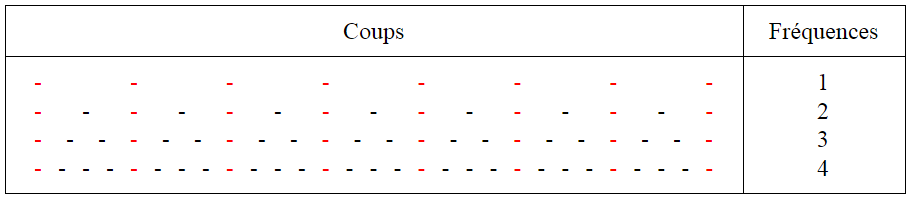
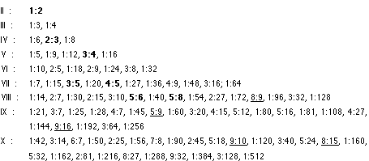
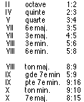

#III. Les théories mathématico-musicales autour de la consonance
##A. La théorie d’Euler: associer des degrés de douceur aux accords

&nbsp;&nbsp;&nbsp;&nbsp;
    En 1731, Euler &eacute;crit un essai sur la musique appel&eacute; <em>Essai d'une nouvelle th&eacute;orie de la musique, expos&eacute;e en toute clart&eacute; selon les principes de l'harmonie les mieux fond&eacute;s (Tentamen novae theoriae musicae ex certissimis harmoniae principiis dilucide expositae</em>), dans lequel il expose sa th&eacute;orie musicale. Elle ne sera publi&eacute;e qu&rsquo;en 1739, apr&egrave;s avoir &eacute;t&eacute; modifi&eacute;e tout au long de sa vie. 

&nbsp;&nbsp;&nbsp;&nbsp;
    D&rsquo;apr&egrave;s Euler, un son est agr&eacute;able car il t&eacute;moigne d&rsquo;un ordre. Soit l&rsquo;ordre est connu, et il s&rsquo;agit seulement d&rsquo;une reconnaissance, soit il est inconnu et il faut le rechercher : ce dernier ordre concerne la musique. Il existe deux types d&rsquo;ordres de sons : la hauteur (si un son est grave ou aigu) et la dur&eacute;e. Nous pouvons aussi admettre l&rsquo;existence d&rsquo;un ordre de son bas&eacute; sur l&rsquo;intensit&eacute;, mais il d&eacute;pend de la manière dont le musicien joue le morceau. 

&nbsp;&nbsp;&nbsp;&nbsp;
    Euler reconna&icirc;t aussi que l&rsquo;ordre de la hauteur est plus important que celui de la dur&eacute;e car celle-ci se mesure par la fr&eacute;quence. Le math&eacute;maticien ram&egrave;ne alors l'&eacute;valuation du plaisir musical &agrave; la mesure des proportions attach&eacute;es aux sons. 

&nbsp;&nbsp;&nbsp;&nbsp;
    Ses id&eacute;es ne sont pas tout &agrave; fait nouvelles, les Grecs anciens utilisaient l&rsquo;id&eacute;e de proportions et la th&eacute;orie de Leibniz parlait d&eacute;j&agrave; de perception inconsciente des rapports des fr&eacute;quences sonores par notre oreille. Toutefois, Euler cherche &agrave; l&rsquo;expliquer.

&nbsp;&nbsp;&nbsp;&nbsp;
    Tout d&rsquo;abord, Euler d&eacute;finit une &eacute;chelle de &ldquo;bont&eacute;&rdquo;. Pour cela, il reprend la th&eacute;orie de la co&iuml;ncidence des coups. Sachant que les coups d&rsquo;une note correspondent &agrave; un niveau de pression, le temps &eacute;coul&eacute; entre deux coups successifs correspond &agrave; la p&eacute;riode de l&rsquo;onde sonore associ&eacute;e &agrave; la note, et le nombre de coups par unit&eacute; de temps &agrave; la fr&eacute;quence. La th&eacute;orie dit qu&rsquo;un intervalle est d'autant plus consonant que le temps entre deux co&iuml;ncidences cons&eacute;cutives de coups est court. Autrement dit un intervalle est plus consonant si la fr&eacute;quence de coups co&iuml;ncidents est &eacute;lev&eacute; (nombre de coups co&iuml;ncidents par unit&eacute; de temps).

&nbsp;&nbsp;&nbsp;&nbsp;
    Une note jou&eacute;e seule, ou deux notes &agrave; l'unisson, donnent l'ordre le plus simple. Cela correspond &agrave; l&rsquo;intervalle entre deux m&ecirc;mes sons (1 et 1). Il r&eacute;pond au rapport $$1:1$$ et correspond au premier degr&eacute; de douceur d&rsquo;Euler. Puis, arrive l&rsquo;octave (1 et 2) de rapport $$1:2$$; qui correspond au deuxi&egrave;me degr&eacute; de douceur. Les rapports $$1:3$$ et $$1:4$$ correspondent &agrave; la quinte de l'octave sup&eacute;rieure et &agrave; la double octave et sont regroup&eacute;s dans le 3e degr&eacute; de douceur.

&nbsp;&nbsp;&nbsp;&nbsp;
    Euler attache ensuite le degr&eacute; $$n+1$$ au rapport $$1:2n$$, c&rsquo;est &agrave; dire qu&rsquo;&agrave; chaque puissance de 2 est attach&eacute; le degr&eacute; sup&eacute;rieur. 

&nbsp;&nbsp;&nbsp;&nbsp;
    Cependant, Euler remarque que $$1:5$$ (qui correspond au rapport des fr&eacute;quences de la sixte mineure 3 octaves en-dessous et qui ne correspond pas &agrave; une puissance de deux mais un nombre premier) doit &ecirc;tre plus complexe que $$1:8$$ qui a le degr&eacute; 4, Euler lui attribue donc le degr&eacute; 5 et en d&eacute;duit par induction que pour $$p$$, un nombre premier, $$1:p$$ est de degr&eacute; $$p$$. 

&nbsp;&nbsp;&nbsp;&nbsp;
    Puis, il essaie de g&eacute;n&eacute;raliser en disant que le rapport $$1:pq$$ "d&eacute;passe" celui de 1:p comme $$1:q$$ d&eacute;passe $$1:1$$. Il faut donc que son degr&eacute; soit compos&eacute; de $$p$$, $$q$$ et $$1$$, ce qui donne le degr&eacute;: $$p + q - 1$$. 

&nbsp;&nbsp;&nbsp;&nbsp;
    Patrice Bailhache proposera en 1997 une autre approche pour obtenir $$p+q-1$$. Si l&rsquo;on prend un rapport $$p:q$$ avec $$p$$ et $$q$$ premiers entre eux, nous avons d&rsquo;apr&egrave;s la th&eacute;orie de la co&iuml;ncidence des coups, que seuls le premier et le dernier coups sont les m&ecirc;mes (le coup en commun provient du fait qu&rsquo;ils soient jou&eacute;s en m&ecirc;me temps; et comme ils sont premiers entre eux, ils ne partagent pas d&rsquo;autres coups en commun). En sachant que le dernier coup de la p&eacute;riode correspond au d&eacute;but de la p&eacute;riode d&rsquo;apr&egrave;s, le total des coups sera $$p+q-1$$.

&nbsp;&nbsp;&nbsp;&nbsp;
    En g&eacute;n&eacute;ralisant, nous associons le rapport $$1:p_1^{k_1}p_2^{k_2}...p_n^{k_n}$$ au degr&eacute; $$
\sum_{i=1}^{n}=(k_i p_i) + 1
$$
avec pides nombres premiers et kides coefficients entiers positifs. nous pouvons aussi remarquer que ces r&eacute;sultats ne sont pas vraiment rigoureux, mais les propri&eacute;t&eacute;s qu&rsquo;Euler en d&eacute;duit sont int&eacute;ressantes.

&nbsp;&nbsp;&nbsp;&nbsp;
    En effet, cette formule peut s&rsquo;appliquer &agrave; plus que 2 sons. Quatre sons dans les rapports $$1:p:q:r$$ avec $$p$$, $$q$$ et $$r$$ premiers sont assimil&eacute;s &agrave; $$1:pqr$$. Si au contraire, ils ne sont pas premiers, et que l&rsquo;on a par exemple: $$1:n:m:k$$ (avec $$n$$, $$m$$, et $$k$$ entiers), il suffit de prendre le $$PPCM$$ de tous ces facteurs, soit $$PPCM(n, m, k)$$, ce qui nous donne $$1:PPCM(n, m, k)$$. Euler peut ainsi toujours se ramener au cas $$1/n$$. 

&nbsp;&nbsp;&nbsp;&nbsp;
    Si par contre, le rapport de 2 sons (ou plus) n&rsquo;est pas de la forme $$1:p$$ mais $$p:q$$ comme la quinte de rapport $$3:2$$, il faudra au pr&eacute;alable les diviser par le $$PGCD$$ de ces nombres, et ensuite &eacute;ventuellement appliquer le $$PPCM$$. Par exemple, $$4:6:8$$ deviendra $$2:3:4$$.

&nbsp;&nbsp;&nbsp;&nbsp;
    La question de la consonance se r&eacute;duit donc au calcul du degr&eacute; de douceur de leur $$PPCM$$ par la formule ci-dessus. Le tableau ci-dessous montre le classement des $$PPCM$$ dans les 16 premiers degr&eacute;s.

&nbsp;&nbsp;&nbsp;&nbsp;
    Dans une deuxi&egrave;me partie de l&rsquo;essai, Euler fait une &eacute;tude math&eacute;matique des harmoniques, dans lequel il justifie la consonance. Son &eacute;tude se base sur le calcul du $$PPCM$$ d&rsquo;un accord, qu&rsquo;il appelle exposant. Il obtient d&rsquo;abord un classement des consonances repr&eacute;sent&eacute; sur le tableau ci-dessous o&ugrave; les caract&egrave;res gras repr&eacute;sentent les rapports des consonances et ceux soulign&eacute;s, aux dissonances traditionnelles:

<em>Tableau 6.1: degr&eacute;s de douceur avec leurs rapports correspondants</em>

&nbsp;

&nbsp;&nbsp;&nbsp;&nbsp;
    Puis, en prenant le tableau pr&eacute;c&eacute;dent et n&rsquo;y laissant que les consonances et dissonances, nous retrouvons cette classification:

<em>Tableau 6.2: les intervalles classiques avec leur degr&eacute; de douceur correspondant</em>

&nbsp;

&nbsp;&nbsp;&nbsp;&nbsp;
    Or, elle correspond &agrave; une des classifications de Mersenne, un religieux math&eacute;maticien et philosophe du XVII&egrave;me. Ce dernier a &eacute;crit <em>Harmonie universelle, contenant la th&eacute;orie et la pratique de la musique, </em>un ouvrage majeur du XVII&egrave;me si&egrave;cle publi&eacute; en 1636 et qui englobe tous les aspects de la musique de cette &eacute;poque<em>.</em> Euler comme Mersenne met en avant l&rsquo;id&eacute;e que les dissonances ne sont que des consonances de degr&eacute; &eacute;lev&eacute;: il n&rsquo;y a qu&rsquo;une fronti&egrave;re floue entre les deux. De nombreuses personnes partagent donc l&rsquo;id&eacute;e d&rsquo;Euler.

&nbsp;&nbsp;&nbsp;&nbsp;
    Mais Euler va plus loin. Il remarque que si l&rsquo;on ajoute un ou plusieurs sons &agrave; un accord, de rapports correspondant &agrave; des diviseurs de l&rsquo;exposant (l&rsquo;exposant &eacute;tant le $$PPCM$$), son degr&eacute; de douceur ne changera pas. Par exemple, $$1:2:3:6$$ a le m&ecirc;me exposant que $$1:6$$ et $$2:3$$ car ils ont le m&ecirc;me $$PPCM$$, c&rsquo;est &agrave; dire 6. Il d&eacute;finit alors l&rsquo;accord dit complet comme un accord dont nous ne pouvons ajouter de sons sans que son degr&eacute; n&rsquo;augmente (c&rsquo;est &agrave; dire sans que son $$PPCM$$ n&rsquo;augmente): cet accord contient donc tous les diviseurs de son exposant. Par exemple, $$1:2:3:6$$ est un accord complet. Pour Euler, un effet de pl&eacute;nitude sera alors ressenti par l&rsquo;oreille. C&rsquo;est comme cela qu&rsquo;il retrouve les accords les plus consonants de chaque degr&eacute;.

&nbsp;&nbsp;&nbsp;&nbsp;
    Prenons l&rsquo;exemple de l&rsquo;accord parfait majeur de do compos&eacute; du do, mi et du sol. Ces trois notes correspondent aux nombres 4, 5 et 6, de $$PPCM$$ 60. L&rsquo;accord complet associ&eacute; sera alors compos&eacute; de 12 notes, associ&eacute;s &agrave; $$1:2:3:4:5:6:10:12:15:20:30:60$$, soit le do1, do2, sol2, do3, mi3, sol3, mi4, sol4, si4, mi5, si5 et si6. Euler pr&eacute;tend alors que cet accord complet est aussi doux que l&rsquo;accord parfait majeur de do (do, mi et sol), alors qu&rsquo;il s&rsquo;&eacute;tale sur 6 octaves et qu&rsquo;il comprend la septi&egrave;me majeure (entre do et si). 

&nbsp;&nbsp;&nbsp;&nbsp;
    On peut le justifier si l'on se r&eacute;f&egrave;re &agrave; la th&eacute;orie moderne des sons partiels de Helmholtz. En produisant les sons do, mi et sol, cette th&eacute;orie dit qu&rsquo;on entendra &eacute;galement d&rsquo;autres fr&eacute;quences de ces notes (ce qui inclue tous les intervalles obtenus &agrave; partir de la note), plus &eacute;lev&eacute;es (comme le do une octave plus haut): ce sont les partiels de ces notes. nous en reparlerons plus tard. Dans notre cas, nous entendrons entre autres le si &agrave; plusieurs reprises, soit en tant que quinte de mi, soit en tant que tierce majeure de sol. Toutefois, l&rsquo;intensit&eacute; de si4 si5 si6 ne sera que tr&egrave;s faible.

TODO accord complet

<em>Enregistrement</em>

&nbsp;&nbsp;&nbsp;&nbsp;
    Autre exemple: si l&rsquo;on ajoute un deuxi&egrave;me do (do2) &agrave; l&rsquo;accord do, mi, et sol, nous aurons les coefficients 4, 5, 6 et 8 de $$PPCM$$ 120. nous sommes donc 1 degr&eacute; plus haut, et l&rsquo;accord compl&eacute;t&eacute; se verra ajout&eacute; un si &agrave; la 7e octave.

&nbsp;&nbsp;&nbsp;&nbsp;
    En r&eacute;sum&eacute;, Euler d&eacute;finit la consonance &agrave; partir de la th&eacute;orie de l&rsquo;ordre et de la th&eacute;orie de la co&iuml;ncidence des coups. Il classe les accords &agrave; partir de leur rapport de fr&eacute;quence: c&rsquo;est le degr&eacute; de douceur d&rsquo;un accord. Si cet accord pr&eacute;sente un rapport de la forme $$p:q$$ (diff&eacute;rent de $$1:q$$), il faut au pr&eacute;alable le diviser par son $$PGCD$$. Si p et q ne sont pas premiers entre eux, il faut aussi le diviser par leur $$PPCM$$. Il d&eacute;finit aussi l&rsquo;accord complet de sorte que si l&rsquo;on ajoute un son &agrave; cet accord, son degr&eacute; de douceur ne pourra qu&rsquo;augmenter.

&nbsp;&nbsp;&nbsp;&nbsp;
    Pourtant, Euler n&rsquo;est pas le seul &agrave; chercher &agrave; expliquer la musique. D&rsquo;Alembert, un de ses contemporains en fera de m&ecirc;me.

