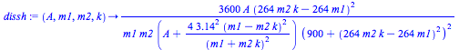

## La théorie d’Helmholtz: quantifier la dissonance

&nbsp;&nbsp;
    Afin d&rsquo;expliquer la consonance, Helmholtz commence par &eacute;tudier le fonctionnement de l&rsquo;oreille, en se basant sur les observations de son &eacute;poque. Cela constitue la premi&egrave;re partie de sa <em>Th&eacute;orie physiologique de la musique</em> publi&eacute; en 1863. Il cherche ensuite &agrave; expliquer la consonance, c&rsquo;est &agrave; dire pourquoi certains sons nous semblent plus agr&eacute;ables que d&rsquo;autres. Pour cela, il se base sur le ph&eacute;nom&egrave;ne des battements: si les fr&eacute;quences de deux sons sont voisines, alors nous entendrons un battement, un son d&eacute;sagr&eacute;able. D&rsquo;un c&ocirc;t&eacute;, plus l&rsquo;&eacute;cart entre les fr&eacute;quences est grande, moins le battement sera entendu, car il sera trop lent pour &ecirc;tre audible. Il en sera de m&ecirc;me si l&rsquo;&eacute;cart est trop petit, comme lorsqu&rsquo;une image clignote tr&egrave;s rapidement et appara&icirc;t comme continue. Il d&eacute;finit donc la consonance et la dissonance &agrave; partir de la pr&eacute;sence ou l&rsquo;absence de battements. 

&nbsp;&nbsp;
    Helmholtz cherche alors la fr&eacute;quence qui est la plus d&eacute;sagr&eacute;able (pour laquelle la dissonance est maximale), et retrouve la valeur de $$30Hz$$. Puis, il trouve une formule qui renvoie la &ldquo;duret&eacute; propre&rdquo; de deux sons simples en fonction de l&rsquo;&eacute;cart de leur fr&eacute;quence (que l&rsquo;on verra apr&egrave;s). Cette duret&eacute; ne correspond pas &agrave; la dissonance, qui d&eacute;pend en plus de l&rsquo;&eacute;nergie des battements. Helmholtz suppose que cette d&eacute;pendance est lin&eacute;aire: la dissonance est ainsi le produit de la duret&eacute; propre de deux sons simples par l&rsquo;&eacute;nergie des battements.

&nbsp;&nbsp;
    Pour retrouver la dissonance de deux sons complexes, il suffit, d&rsquo;apr&egrave;s Fourier, de simplement additionner toutes les dissonances entre les harmoniques correspondants. Sachant que le timbre correspond au spectrogramme du son, ce r&eacute;sultat d&eacute;pend donc du timbre du son, soit de l&rsquo;instrument. 

&nbsp;&nbsp;
    On remarque que certains r&eacute;sultats de Helmholtz sont obtenus arbitrairement, ce qui montre la subjectivit&eacute; de la consonance et de la dissonance.

&nbsp;&nbsp;<strong><strong>&nbsp;</strong></strong>

&nbsp;&nbsp;
    Helmholtz &eacute;tablit ensuite un graphique, sur lequel est bas&eacute; sa th&eacute;orie musicale, qui pr&eacute;sente la dissonance de plusieurs notes (calcul&eacute;e &agrave; partir des 10 premiers partiels harmoniques du violon) en fonction de la note. Le voici:

&nbsp;&nbsp;
    Ce graphique est en accord avec les consonances d&eacute;j&agrave; &eacute;tablies (elles ont des valeurs proches de 0): l&rsquo;unisson (do), l&rsquo;octave (do), la quinte (sol), quarte (fa), sixte majeure (la), tierce majeure (mi), tierce mineure (mib) et sixte mineure (lab). Plus nous nous &eacute;loignons de ces intervalles, plus la dissonance cro&icirc;t rapidement. Cette th&eacute;orie scientifique concorde donc avec le monde de la musique.

&nbsp;&nbsp;<strong><strong>&nbsp;</strong></strong>

&nbsp;&nbsp;
    Helmholtz parvient &agrave; ces r&eacute;sultats en plusieurs &eacute;tapes. D&rsquo;abord, il calcule l&rsquo;&eacute;nergie o&ugrave; les battements sont maximaux. nous fixons $$f_1$$, la fr&eacute;quence de r&eacute;f&eacute;rence par rapport &agrave; quoi nous allons calculer la dissonance d&rsquo;autres notes de fr&eacute;quence $$f$$. Cela correspond au do dont la fr&eacute;quence est $$264Hz$$ dans notre cas. L&rsquo;&eacute;cart des deux fr&eacute;quences, $$f - f_1 = f - 264$$.

&nbsp;&nbsp;
    Ensuite, Helmholtz choisit la fonction: $$f(x)=(\frac{60x}{900+x^2})^2$$pour calculer la duret&eacute; propre en notant toutefois que "c'est l'expression la plus simple qui remplisse les conditions donn&eacute;es mais elle est naturellement arbitraire jusqu'&agrave; un certain point." Il a s&ucirc;rement obtenu cette fonction en sachant que la dissonance &eacute;tait maximale en $$30Hz$$, et presque nulle lorsque la diff&eacute;rence des fr&eacute;quence est grande. Dans notre cas, x correspond &agrave; la diff&eacute;rence de fr&eacute;quences entre les deux sons, ce qui nous donne:

$$D = \frac{3600*(f-264)^2}{(900+(f-264)^2)^2}$$

&nbsp;&nbsp;
    Et en multipliant l&rsquo;&eacute;nergie des battements (E) par D, nous obtenons la dissonance de deux sons simples. nous avons pour f variant de 296 &agrave; 396Hz, (qui correspond &agrave; la courbe 1:1 dans le graphique)

&nbsp;&nbsp;
    Jusqu&rsquo;&agrave; pr&eacute;sent, nous avons &eacute;tudi&eacute; la dissonance de deux sons simples. Pour obtenir la dissonance de deux sons en dents de scie, ce qui correspond au timbre d&rsquo;un instrument &agrave; cordes frott&eacute;es, il faut maintenant additionner les partiels des deux sons concern&eacute;s (Helmholtz prendra les 10 premiers harmoniques).

&nbsp;&nbsp;<strong><strong>&nbsp;</strong></strong>

&nbsp;&nbsp;
    Maintenant, lorsque l&rsquo;on fait varier $$f$$ entre $$264$$ et $$528$$ ($$=2*264$$; puisque la note se retrouve entre le do et le do une octave au-dessus) nous pouvons remplacer $$f$$ par $$f_1*k$$ ($$k$$ varie entre 1 et 2 et correspond donc au rapport $$f/f_1$$), soit $$264*k$$. nous pouvons calculer la dissonance entre deux harmoniques des deux sons (la $$m_1$$-&egrave;me du premier, de fr&eacute;quence $$264$$, et la $$m_2$$-&egrave;me du second, de fr&eacute;quence $$f$$) gr&acirc;ce &agrave; cette formule:

(o&ugrave; $$3.14$$ correspond &agrave; $$\pi$$, dissh la dissonance de deux partiels et $$A$$ est une constante)

&nbsp;&nbsp;
    Pour $$k$$ variant de $$1$$ &agrave; $$2$$, et $$m_1$$ et $$m_2$$ variant de $$1$$ &agrave; $$10$$ chacun, car nous prendrons les 10 premiers harmoniques (et $$A$$ qui ici vaut $$0.1$$), nous obtenons graphiquement:

&nbsp;&nbsp;
    La th&eacute;orie de Helmholtz est fond&eacute;e sur l&rsquo;&eacute;tude des battements. D&rsquo;apr&egrave;s lui, la dissonance entre deux sons simple est &eacute;gal au produit de l&rsquo;&eacute;nergie des battements par la duret&eacute; propre de l&rsquo;accord, la duret&eacute; propre &eacute;tant obtenue &agrave; partir de l&rsquo;&eacute;cart de fr&eacute;quences des deux sons. Pour obtenir la dissonance de deux sons complexes, il suffit d&rsquo;additionner la dissonance de leurs harmoniques. nous obtenons en m&ecirc;me temps les accords consonants, car ils correspondent aux accords de dissonance faible.

&nbsp;&nbsp;
    Nous avons ainsi vu comment trois scientifiques expliquent la consonance: Euler en associant des degr&eacute;s de douceur aux rapports de fr&eacute;quence justifi&eacute;s par la co&iuml;ncidence des coups; D&rsquo;Alembert par des constats, et Helmholtz par les battements. Toutefois, leur th&eacute;ories sont d&rsquo;une certaine mesure arbitraires, car ils ne se fondent pas sur des hypoth&egrave;ses commun&eacute;ment accept&eacute;es. 

&nbsp;&nbsp;  
