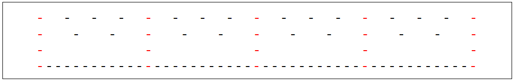
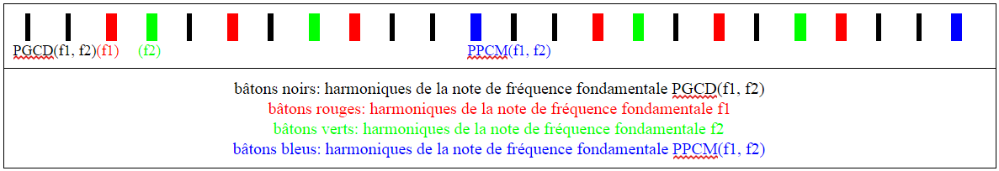

## L’analyse des coups et l’analyse de Fourier

&nbsp;&nbsp;
    Consid&eacute;rons la note en terme de coups, c&rsquo;est &agrave; dire que la fr&eacute;quence de la note correspond &agrave; la fr&eacute;quence de coups et comparons les coups des deux notes. Nous faisons partir les coups en phase (c&rsquo;est &agrave; dire qu&rsquo;ils co&iuml;ncident au moins &agrave; un moment) et observons l&rsquo;incidence des coups des deux notes entre deux moments cons&eacute;cutifs o&ugrave; les coups co&iuml;ncident. Le rapport de fr&eacute;quences a une interpr&eacute;tation simple: il correspond au nombre moyen de coups du deuxi&egrave;me son entre deux coups cons&eacute;cutifs du premier sur cette p&eacute;riode. 

&nbsp;&nbsp;
    On remarque que pour que deux coups des notes co&iuml;ncident &agrave; nouveau, il faut que le rapport des fr&eacute;quences soit rationnel. Sans perte de g&eacute;n&eacute;ralit&eacute;, choisissons l&rsquo;unit&eacute; de temps telle que la fr&eacute;quence de la premi&egrave;re note soit 1 (si la fr&eacute;quence de la deuxi&egrave;me note est $$f$$, alors leur rapport est $$f$$), et disons qu&rsquo;au temps $$t=0$$, les coups des deux notes co&iuml;ncident. Alors, les instants $$t$$ o&ugrave; l&rsquo;on a un coup de la premi&egrave;re sont de la forme $$n$$ ($$n$$ entier) et les coups de la deuxi&egrave;me sont aux instants $$m/f$$ ($$m$$ est entier). Ainsi, pour que les coups co&iuml;ncident &agrave; nouveau, cela veut dire qu&rsquo;il existe un instant $$t$$ tel que $$t=n=m/f$$ (o&ugrave; $$m$$ et $$n$$ sont des entiers non nuls), ce qui &eacute;quivaut &agrave; $$f=m/n$$, ce qui veut dire que f est rationnel. Ainsi nous avons d&eacute;montr&eacute; que pour que les coups co&iuml;ncident &agrave; nouveau il faut et suffit que le rapport de fr&eacute;quence des deux notes soit rationnel (on dit aussi qu&rsquo;elles sont commensurables). nous pouvons g&eacute;n&eacute;raliser cela &agrave; plus de trois notes ce qui nous int&eacute;ressera plus puisque cela correspondra &agrave; des accords. Ainsi si l&rsquo;on compare les coups de $$n$$ notes, tous leurs coups co&iuml;nciderons si et seulement si leurs fr&eacute;quences sont deux &agrave; deux commensurables. Dor&eacute;navant, nous consid&eacute;rerons donc uniquement des rapports de fr&eacute;quences rationnels. Une cons&eacute;quence de cette propri&eacute;t&eacute; est que l&rsquo;on peut donc toujours choisir une &eacute;chelle de temps telle que les fr&eacute;quences des deux notes soient enti&egrave;res, puisque partant du de l&rsquo;&eacute;chelle que l&rsquo;on a choisi dans la d&eacute;monstration, il suffit de la multiplier par le d&eacute;nominateur de la fraction.

<em>Repr&eacute;sentation de deux notes par leurs coups dont le rapport des fr&eacute;quences est 3/4</em>

TODO a modifier le paragraphe suivant

&nbsp;&nbsp;
    Dans la figure ci-dessus, nous avons repr&eacute;sent&eacute; deux notes dont le rapport des fr&eacute;quences est $$3/4$$, mais en dessous, nous avons rajout&eacute; une nouvelle note. Elle a pour particularit&eacute; que chacun de ses coups co&iuml;ncide avec un coup des deux notes et que c&rsquo;est la note de fr&eacute;quence maximale qui v&eacute;rifie cette propri&eacute;t&eacute;. Comme le rapport des notes est rationnel, utilisons donc une &eacute;chelle de temps telle que leurs fr&eacute;quences respectives $$f_1$$ et $$f_2$$ soient enti&egrave;res et que &agrave; l&rsquo;instant $$t=0$$ leurs coups correspondent, calculons la fr&eacute;quence de la note recherch&eacute;e. Les notes de fr&eacute;quences $$f_1'$$ telles que chaque coups de celles-ci correspondent &agrave; un coup de la premi&egrave;re note ont pour propri&eacute;t&eacute; que $$f_1'$$ est un diviseur de $$f_1$$. En effet, pour tout entier $$n$$, il existerait alors un entier $$m$$ tel que, $$n/f_1$$&rsquo;(i.e. les instants o&ugrave; l&rsquo;on a un coup de $$f_1'$$) soit égal à $$m/f_1$$(i.e. les instants o&ugrave; l&rsquo;on a un coup de $$f_1$$) donc $$m*f_1=n*f_1$$ autrement dit tous multiples de $$f_1$$ sont multiples de $$f_1'$$ donc $$f_1'$$ est un diviseur de $$f_1$$. Ainsi, la fr&eacute;quence de la note recherch&eacute;e est un diviseur de $$f_1$$ et de $$f_2$$, et c&rsquo;est la plus grande possible, donc c&rsquo;est le $$PGCD$$ de $$f_1$$ et de $$f_2$$. 

&nbsp;&nbsp;
    On peut g&eacute;n&eacute;raliser ceci avec plusieurs notes, au quel cas nous prenons le $$PGCD$$ de toutes les fr&eacute;quences. nous remarquerons que cette fr&eacute;quence d&eacute;pend donc de l&rsquo;&eacute;chelle de temps, mais la note elle m&ecirc;me en est ind&eacute;pendante puisque changer l&rsquo;&eacute;chelle correspond &agrave; multiplier chaque fr&eacute;quence par $$k$$, mais $$PGCD(k*f_1, k*f_2)=k*PGCD(f_1, f_2)$$ donc son rapport avec une autre note $$k*f$$ donnera la m&ecirc;me fraction. Cette note correspond &agrave; la note fondamentale de l&rsquo;accord. Par exemple, dans l&rsquo;exp&eacute;rience, elle correspond au Mi0 par rapport &agrave; l&rsquo;accord de Mi2, Sol#2 et Si2. Ainsi, elle peut aussi &ecirc;tre interpr&eacute;t&eacute;e &agrave; l&rsquo;aide de l&rsquo;analyse de Fourier comme la fr&eacute;quence fondamentale la plus &eacute;lev&eacute;e possible telle que les sons de l&rsquo;accord consid&eacute;r&eacute; sont ses harmoniques (puisque leurs fr&eacute;quence seront alors ses multiples).

&nbsp;&nbsp;
    La quatri&egrave;me note dans la figure ci- dessus a pour propri&eacute;t&eacute; remarquable que chacun des coups de l&rsquo;une des deux premi&egrave;res notes co&iuml;ncident avec un coup de la quatri&egrave;me et que c&rsquo;est celle de fr&eacute;quence minimale qui v&eacute;rifie cette propri&eacute;t&eacute;. Notons $$f_1$$ la fr&eacute;quence de la premi&egrave;re note et $$f_2$$ la fr&eacute;quence de la deuxi&egrave;me et choisissons une &eacute;chelle de temps telle que ces fr&eacute;quences soient enti&egrave;res. Les notes de fr&eacute;quences $$f_1'$$ telles que chaque coups de la premi&egrave;re note correspondent &agrave; celles-ci ont pour propri&eacute;t&eacute; que $$f_1$$&rsquo; est un multiple de $$f_1$$, puisqu&rsquo;alors pour tout entier $$n$$, il existe un entier $$m$$ tel que, $$\frac{n}{f_1}=\frac{m}{f_1'}$$ donc $$m*f_1=n*f_1'$$ autrement dit tous multiples de $$f_1'$$ sont multiples de $$f_1$$ donc $$f_1'$$ est un multiple de $$f_1$$. Ainsi, la fr&eacute;quence de la note recherch&eacute;e est &agrave; la fois multiple de $$f_1$$ et de $$f_2$$, et l&rsquo;on cherche la fr&eacute;quence la plus petite possible, autrement dit c&rsquo;est le $$PPCM$$ de $$f_1$$ et $$f_2$$.

&nbsp;&nbsp;
    On peut g&eacute;n&eacute;raliser cela &agrave; plusieurs notes, auquel cas nous associons la note dont la fr&eacute;quence est le $$PPCM$$ de toutes les fr&eacute;quences des notes. Encore une fois, la fr&eacute;quence d&eacute;pend de l&rsquo;unit&eacute; de mesure, mais pas la note ($$PPCM(k*f_1, k*f_2)=k*PPCM(f_1, f_2)$$). nous remarquererons que cette note traduit en fait le plus petit &eacute;cart entre deux coups cons&eacute;cutifs des notes consid&eacute;r&eacute;es, ce qui correspond aux battements. Ainsi, plus il est &eacute;lev&eacute;, plus l&rsquo;accord sera dissonant. Une interpr&eacute;tation de cette note par l&rsquo;analyse de Fourier est qu&rsquo;elle correspond &agrave; la plus petite (en terme de hauteur) des harmoniques qu&rsquo;ont toutes les notes en commun.

&nbsp;&nbsp;
    Ainsi, pour chaque accord, nous pouvons associer ces deux notes qui traduisent les propri&eacute;t&eacute;s g&eacute;n&eacute;rales de l&rsquo;accord, et l&rsquo;on pourrait penser qu&rsquo;ils auront donc une consonance &eacute;quivalente lorsque ces deux notes sont les m&ecirc;mes. C&rsquo;est pr&eacute;cis&eacute;ment ce que fait Euler qui se ramenait ainsi au cas $$1/n$$ pour un accord en prenant le PPCM de toutes les fr&eacute;quences de l&rsquo;accord. De plus le lien que nous avons &eacute;tabli entre la co&iuml;ncidence des coups et l&rsquo;analyse de Fourier permet de mettre en valeur le lien sous-jacent des travaux de d&rsquo;Alembert avec cette th&eacute;orie qu&rsquo;il cherchait &agrave; ne pas utiliser.

&nbsp;&nbsp;
    Cette vision duale avec la co&iuml;ncidence des coups et de l&rsquo;analyse de Fourier permet donc une repr&eacute;sentation avec fondement de la r&eacute;alit&eacute; physique d&rsquo;un accord et permettent donc de mieux comprendre, math&eacute;matiquement et physiquement, ce qui fait que deux sons soient consonants entre eux.

